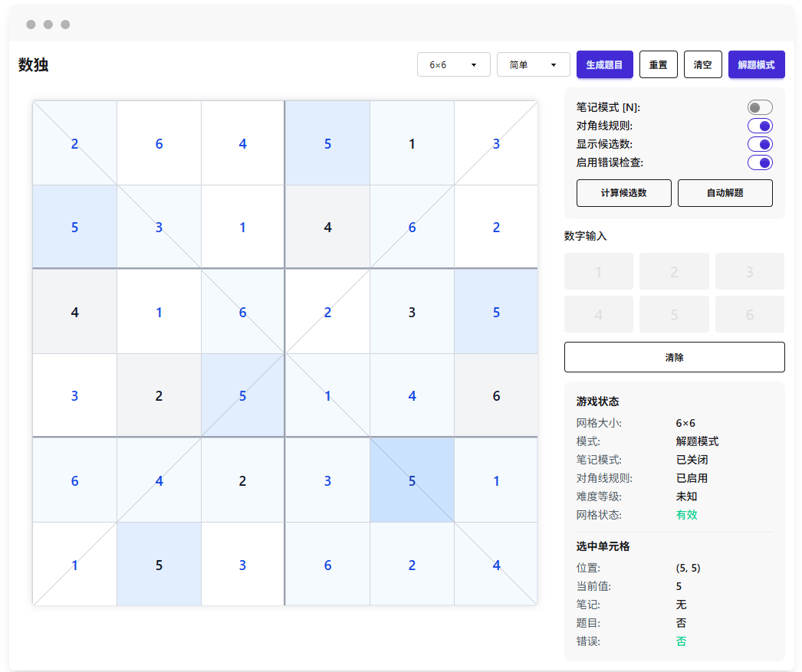

# 数独游戏 (Sudoku)

<div align="right">
  <a href="README.md">English</a> | <a href="README.zh-CN.md">简体中文</a>
</div>

一款现代化、功能丰富的数独核心库与应用界面，支持多种数独变体、难度级别和辅助功能。



## 功能特点

- 📱 响应式设计，适配各种屏幕尺寸
- 🔢 多种盘面支持（4x4、6x6、9x9 等）
- 🎮 多种数独变体（经典、对角线等）
- 🧩 自动候选数计算和显示
- 🎯 多级难度支持（简单、中等、困难、专家）
- 💾 游戏进度保存和恢复
- 🎨 可自定功能设置
- 🔍 解题辅助工具
- 其余功能核心库已实现或预留扩展位置，UI 界面待后续实现

## 技术栈

React + Vite + TypeScript + Tailwind CSS + DaisyUI

## 快速开始

### 安装依赖

```bash
# 使用pnpm (推荐)
pnpm install

# 或使用npm
npm install

# 或使用yarn
yarn
```

### 开发环境

```bash
pnpm dev
```

访问 http://localhost:3000 查看应用

### 构建生产版本

```bash
pnpm build
```

### 预览生产版本

```bash
pnpm serve
```

## 项目结构

```
.
├── public/              # 静态资源
├── src/                 # 源代码
│   ├── core/            # 数独核心逻辑
│   │   ├── engine/      # 数独引擎
│   │   ├── solvers/     # 解题算法
│   │   ├── generators/  # 谜题生成
│   │   ├── validation/  # 规则验证
│   │   ├── variants/    # 数独变体
│   │   └── ...
│   ├── pages/           # 页面组件
│   ├── components/      # 可复用组件
│   ├── hooks/           # 自定义Hooks
│   ├── store/           # 状态管理
│   ├── utils/           # 工具函数
│   ├── App.tsx          # 主应用组件
│   └── main.tsx         # 入口文件
├── tests/               # 测试文件
├── vite.config.js       # Vite配置
├── tailwind.config.js   # Tailwind配置
├── tsconfig.json        # TypeScript配置
└── package.json         # 依赖和脚本
```
